<!--
  Sathsreehari K — GitHub profile
  Clean, technical, evidence-first.
-->

  

  <a href="https://github.com/sath17-o/shravya-inclucode"><b>SHRAVYA</b></a>
  &nbsp;·&nbsp;
  <a href="https://github.com/sath17-o/GraphMS-Net"><b>GRAPHMS-NET</b></a>
  &nbsp;·&nbsp;
  <a href="https://github.com/sath17-o/QML-SleepNet"><b>QML-SLEEPNET</b></a>

  

 

## What I build

I work on **AI systems where the engineering has to survive contact with reality** — noisy data, constrained hardware, provenance requirements, accessibility needs, reproducibility, and claims that should hold up under inspection.

I care less about making a model look impressive in isolation and more about building the **complete system around it**: data → model → validation → failure boundaries → reproducible execution.

---

<table>
<tr>
<td width="50%" valign="top">

### 🔊 Shravya
**Accessible classroom intelligence for Malayalam-first learning**

Local speech recognition → teacher verification → trusted student revision.

The central rule is deliberately simple:

> **AI assists. The teacher remains the source of classroom truth.**

<code>FastAPI</code> <code>React</code> <code>TypeScript</code> <code>faster-whisper</code> <code>AI4Bharat</code>

**279 backend tests · 97 frontend tests · 9 judge-flow tests**

[**Explore Shravya →**](https://github.com/sath17-o/shravya-inclucode)

</td>
<td width="50%" valign="top">

### 🧠 GraphMS-Net
**Reproducible graph-aware 3-D MRI research**

Multimodal MS lesion segmentation with a frozen CNN → GNN → hybrid-fusion pipeline, downstream MRI-derived modelling, provenance locks, and reproducibility checks.

<code>PyTorch</code> <code>3-D MRI</code> <code>GNN</code> <code>nnU-Net</code> <code>Medical Imaging</code>

**5-fold development CV · DSC 0.7480 ± 0.0320**

[**Explore GraphMS-Net →**](https://github.com/sath17-o/GraphMS-Net)

</td>
</tr>

<tr>
<td colspan="2" valign="top">

### 🌙 QML-SleepNet
**Quantum ML + causal inference + temporal deep learning for sleep-apnea research**

A reproducibility-focused system combining physiological modelling, quantum machine learning, causal analysis, and CNN-BiLSTM temporal representations on PhysioNet Apnea-ECG.

<code>Quantum ML</code> <code>Causal Inference</code> <code>CNN-BiLSTM</code> <code>PhysioNet</code> <code>PyTorch</code>

**35 official-test records · 17,248 scored minutes · AUROC 0.9675**

[**Explore QML-SleepNet →**](https://github.com/sath17-o/QML-SleepNet)

</td>
</tr>
</table>

---

## The operating system

~~~text
01  Start with the real constraint.
02  Make the data path explicit.
03  Build the smallest system that can be falsified.
04  Test the failure boundaries, not only the happy path.
05  Freeze provenance before making claims.
06  Reproduce the result from a clean environment.
07  Never let presentation outrun evidence.
~~~

---

## Current signal

  
  

  Research engineering · trustworthy AI · medical ML · accessibility · reproducible systems

